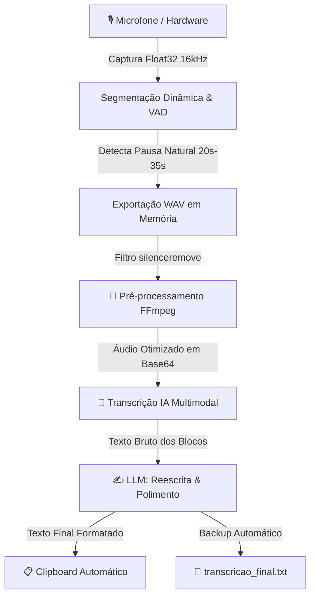

# WhisperGo 🎙️✨

> **Transcrição contínua de voz ultra-rápida e inteligente diretamente para a sua área de transferência.**  
> Desenvolvido em **Golang** com interface nativa Dark Mode, processamento assíncrono de áudio e reescrita contextual via Inteligência Artificial.

[](https://github.com/vagnervrds/whispergo/releases)
[](https://github.com/vagnervrds/whispergo)

---

## ⚡ Sobre o Projeto

O **WhisperGo** é um utilitário desktop minimalista e de altíssimo desempenho para Windows, criado para quem deseja ditar pensamentos, mensagens, e-mails, notas de reuniões ou código sem interrupções e sem fricção.

Diferente de ditados comuns que despejam palavras soltas cheias de vícios de linguagem ("ééé", "tipo", gaguejos), o **WhisperGo** captura o áudio com fidelidade de estúdio, remove ruídos e silêncios mortos, transcreve em blocos com IA multimodal e, ao final, aplica uma **reescrita inteligente** que pontua, estrutura e corrige o texto — entregando o resultado polido e pronto no seu **Clipboard (Ctrl + V)**!

Agora com **atalho de teclado global padrão (`Ctrl + Alt + Win + R`)**, você nem precisa estar com a janela do WhisperGo aberta ou visível: pressione o atalho de qualquer outro programa para iniciar e parar gravações instantaneamente. Durante a gravação, a janela aparece em primeiro plano para você acompanhar o progresso em tempo real!

---

## 🤖 Feito com AntiGravity & Gemini 3.8 (100% Vibe Coding)

> [!NOTE]
> Este projeto foi concebido, arquitetado e desenvolvido **100% via "Vibe Coding" utilizando o modelo Gemini 3.8 na plataforma AntiGravity**.
>
> 🔓 **Liberdade Total de Uso**: Qualquer pessoa tem acesso irrestrito a este código. Você tem total liberdade para:
> - Usar pessoal ou comercialmente;
> - Modificar, refatorar e adaptar para suas necessidades;
> - Distribuir, criar produtos derivados ou até **vender**;
> - Utilizar para estudos, testes de engenharia e benchmarks.
>
> 🤝 **Contribuições são muito bem-vindas!** Abra uma Issue, envie um Pull Request ou compartilhe sugestões para continuarmos evoluindo o projeto juntos.

---

## 🔄 Como Funciona o Pipeline (Do Microfone ao Ctrl + V)



### 1. 🎙️ Captura de Áudio em Baixa Latência (Hardware Direto)
- Utiliza a biblioteca nativa **Miniaudio** (`malgo`), garantindo altíssimo desempenho e consumo insignificante de memória e CPU.
- Grava em canal único (**Mono**), taxa de amostragem de **16.000 Hz** em ponto flutuante (**Float32**), padrão ouro para reconhecimento de fala e transcrição.
- Permite selecionar qualquer microfone conectado ao computador ou utilizar o padrão do sistema.

### 2. ✂️ Segmentação Contínua & VAD (Voice Activity Detection)
- **Nada de cortes bruscos:** O sistema monitora a energia sonora (volume RMS) em tempo real.
- Quando o áudio atinge o tempo configurado (mínimo de 20s), ele não corta de forma arbitrária; ele aguarda uma **pausa natural na fala** (silêncio de ~0.45s abaixo do limiar de ruído) para fechar o bloco.
- Se a fala for ininterrupta, há um limite de segurança de 35s para despachar o chunk.
- Ao pressionar **ENTER** ou clicar em Parar, o buffer remanescente é instantaneamente drenado e processado.

### 3. 🧹 Pré-processamento de Áudio com FFmpeg
- Antes de qualquer tráfego de rede, o áudio passa pelo **FFmpeg** em segundo plano (processo silencioso e oculto, sem janelas pretas):
  ```bash
  silenceremove=start_periods=1:start_duration=0.1:start_threshold=-40dB:stop_periods=-1:stop_duration=0.3:stop_threshold=-40dB
  ```
- **Benefícios:**
  - Corta o silêncio estático antes do início da fala e no final do bloco;
  - Reduz drasticamente o tamanho do arquivo WAV / Base64;
  - Diminui a latência de upload e o consumo de tokens/banda nas APIs.

### 4. 🧠 Transcrição Multimodal via IA
- O arquivo de áudio tratado é enviado diretamente para endpoints modernos com suporte a áudio (como **Google Gemini 2.5 Flash / Pro**, **OpenAI Whisper**, **GPT-4o Audio**, etc. via **OpenRouter** ou API própria).
- Possui mecanismo de fallback resiliente (`input_audio` nativo e fallback para data URI `audio/wav`).

### 5. ✨ Reescrita, Polimento e Pontuação (LLM Post-Processing)
- Ao finalizar a fala, todos os fragmentos transcritos são reunidos e enviados para uma LLM especializada em pós-processamento de fala.
- **O que a IA faz:**
  - Remove hesitações e vícios de linguagem ("hã", "ééé", "tipo assim", repetições acidentais);
  - Insere pontuação correta (vírgulas, pontos finais, parágrafos, interrogações);
  - Ajusta concordância verbal e gramática mantendo **100% da ideia e intenção originais** do locutor.

### 6. 📋 Entrega Instantânea (Clipboard + Arquivo)
- O texto refinado é automaticamente copiado para a **Área de Transferência** do sistema.
- Basta abrir qualquer aplicativo (VS Code, Discord, Slack, WhatsApp, Word, etc.) e pressionar `Ctrl + V`.
- Um backup da última transcrição também é gravado em `transcricao_final.txt`.

---

## 🌟 Recursos em Destaque

| Recurso | Descrição |
| :--- | :--- |
| **Interface Minimalista Dark** | Janela compacta (390x460 px), visual escuro moderno integrado à barra de título nativa do Windows (DWM Immersive Dark Mode). |
| **Atalho Rápido (ENTER)** | Pressione a tecla `ENTER` para disparar e parar gravações instantaneamente. |
| **Atalho Global Padrão (`Ctrl + Alt + Win + R`)** | Inicie e encerre gravações a partir de qualquer aplicativo do Windows. A combinação é 100% personalizável na tela de Ajustes. |
| **Primeiro Plano Automático (`Always-on-Top`)** | Durante a gravação, a janela restaura automaticamente e se fixa no topo para você acompanhar o progresso e o VU meter. |
| **Fila Assíncrona Não-Bloqueante** | Pare uma gravação e inicie outra de imediato. O processamento da anterior segue em background enquanto você já dita a próxima. |
| **Timer Monotônico & VU Meter** | Visualizador de volume animado em tempo real e contador contínuo sem resets esquisitos entre blocos. |
| **Histórico e Exportação** | Histórico com botão **💾 Salvar** individual e **💾 Salvar Tudo** para exportar arquivos de texto organizados na pasta `transcricoes/`. |
| **Compatibilidade Ampla** | Suporta qualquer provedor compatível com o formato OpenAI (OpenRouter, Groq, Ollama, vLLM, LocalAI) e suporte à Anthropic Claude. |
| **Validação de API Key** | Notificação inteligente que alerta e abre as configurações caso nenhuma chave esteja configurada. |
| **Logs com Rotação Automática** | Armazena histórico em `log/log.log`, rotacionando a cada 1MB e retendo apenas os 2 arquivos mais recentes. |

---

## 🖥️ Requisitos do Sistema

- **Sistema Operacional:** Windows 10 ou Windows 11 (64-bit).
- **FFmpeg:** Instalado e configurado na variável de ambiente `PATH` ([Download FFmpeg](https://ffmpeg.org/download.html)).
- **WebView2 Runtime:** Já instalado por padrão no Windows 10/11 (utilizado para renderizar a interface gráfica ultra-leve).
- **Chave de API:** Uma chave de API compatível (ex: [OpenRouter](https://openrouter.ai/), OpenAI, Anthropic, etc.).

---

## 📥 Como Baixar e Usar

### 📦 Baixar o Executável Pronto (Releases)

Nós disponibilizamos o executável compilado pronto para uso diretamente na aba de **Releases** do repositório! Você não precisa instalar compiladores nem configurar Go se quiser apenas utilizar o aplicativo.

1. Acesse a seção de **[Releases](https://github.com/seu-usuario/whispergo/releases)** e baixe o `WhisperGo.exe` (ou o `.zip` da versão mais recente).
2. Certifique-se de que o **FFmpeg** está acessível no seu `PATH` (abra o terminal e digite `ffmpeg -version` para testar).
3. Execute o `WhisperGo.exe`.
4. Clique na engrenagem ⚙️ para inserir sua **API Key** e o modelo de sua preferência (ex: `google/gemini-2.5-flash`).
5. **Produtividade Máxima no Dia a Dia:**
   - Pressione o atalho de teclado global padrão: **`Ctrl + Alt + Win + R`** em qualquer programa;
   - O WhisperGo aparecerá em primeiro plano gravando a sua voz;
   - Ao concluir sua fala, aperte novamente **`Ctrl + Alt + Win + R`** (ou a tecla `ENTER`);
   - Em segundos, a IA remove os ruídos, pontua o texto e copia para o seu Clipboard: basta colar com **`Ctrl + V`**!

---

## 🛠️ Como Compilar o Código Fonte

Se você deseja inspecionar o código, fazer modificações ou compilar por conta própria:

### Pré-requisitos de Desenvolvimento
1. **Golang 1.20+** instalado ([golang.org](https://go.dev/dl/)).
2. Compilador C para Windows (ex: **TDM-GCC** ou **MinGW-w64**) necessário para o CGO da biblioteca de áudio `malgo`.
3. **Git**.

### Passo a Passo de Compilação

1. **Clone o repositório:**
   ```bash
   git clone https://github.com/seu-usuario/whispergo.git
   cd whispergo
   ```

2. **Baixe as dependências:**
   ```bash
   go mod download
   ```

3. **Compilar usando o script automatizado:**
   O projeto inclui um script `build.bat` que encerra instâncias abertas, compila os recursos de ícone do Windows e incrementa automaticamente o número da build:

   - **Build de Produção (Sem janela de console preta):**
     ```cmd
     build.bat
     ```

   - **Build de Depuração (Com console ativo para acompanhar logs ao vivo):**
     ```cmd
     build.bat --debug
     ```

4. O executável `WhisperGo.exe` será gerado na raiz da pasta.

---

## ⚙️ Configurações (`whisper_config.json`)

Na primeira execução, você pode configurar pelo próprio modal da interface ou editar o arquivo `whisper_config.json`:

```json
{
  "provider": "openai",
  "base_url": "https://openrouter.ai/api/v1",
  "api_key": "SUA_API_KEY_AQUI",
  "last_audio_model": "google/gemini-2.5-flash",
  "last_rewrite_model": "google/gemini-2.5-flash",
  "selected_microphone": "default",
  "chunk_seconds": 30,
  "min_chunk_seconds": 20,
  "max_chunk_seconds": 35,
  "silence_pause_seconds": 0.45,
  "silence_threshold": 0.008,
  "sample_rate": 16000,
  "global_hotkey": "Ctrl + Alt + Win + R"
}
```

---

## 💡 Modelos Recomendados (Via OpenRouter)

Graças à flexibilidade de modelos, você pode escolher o que melhor atende ao seu custo e velocidade:

- **`google/gemini-2.5-flash`** *(Altamente Recomendado)*: Extremamente rápido, excelente compreensão de áudio em português e custo baixíssimo.
- **`google/gemini-2.5-pro`**: Máxima precisão e enriquecimento de vocabulário para termos técnicos ou textos complexos.
- **`openai/gpt-4o-mini`**: Excelente alternativa leve e ágil para a etapa de reescrita.
- **`anthropic/claude-3.5-haiku`** ou **`anthropic/claude-3.7-sonnet`**: Estilo de redação natural e refinamento linguístico impecável.

---

## 🤝 Como Contribuir

Contribuições de qualquer tipo são muito bem-vindas! Seja corrigindo um bug, sugerindo uma nova funcionalidade ou melhorando a documentação:

1. Faça um **Fork** do projeto.
2. Crie uma Branch para sua feature (`git checkout -b feature/minha-melhoria`).
3. Faça o Commit das alterações (`git commit -m 'feat: adiciona atalho global no sistema'`).
4. Envie a Branch para o seu repositório remoto (`git push origin feature/minha-melhoria`).
5. Abra um **Pull Request** detalhando as alterações.

---

## 📄 Licença e Liberdade de Uso

Este projeto é disponibilizado sob uso **100% livre e irrestrito**. Sinta-se à vontade para utilizar para propósitos acadêmicos, pessoais ou comerciais, criar forks, redistribuir ou incorporar em suas próprias ferramentas.

---

<div align="center">
  <sub>Criado com paixão e produtividade via Vibe Coding com <b>Gemini 3.8</b> no <b>AntiGravity</b>. 🚀</sub>
</div>

